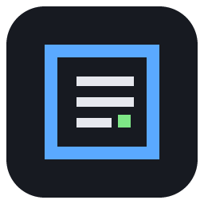

<p align="center"></p>

# Bracket

The template and vendored kit behind AxialForge's self-hosted apps (MediaLedger, Linewatch and the
ones to come). One core, two shells: a **web server** for a Raspberry Pi behind Caddy and an
**Electron desktop app**, sharing the same pages, the same look, the same security model. Zero
runtime dependencies for the core and the web server.

What every app built on it gets without writing it:

- the app frame: sidebar with role-aware navigation and badges, eight colour themes, phone layout
- tables with sort, filter and row-click; tiles; number / bar / donut / trend / time-series / column cards with hover details
- an **editable dashboard**: a catalog of cards the user adds, sizes, drags, configures; layouts saved per account
- accounts and roles (admin / standard / guest), sessions, lockout, LAN-only, two-factor codes, re-authentication, audit log, the Security page
- settings with secret redaction, notifications (webhook + e-mail), a Home Assistant status URL, CSV downloads, exports
- System, Log and About pages; silent desktop updates; a screenshot-based release gate
- a Pi installer that sits next to the other apps, a Caddy site block, a verified release package, CI

## Start a new app

```bash
gh repo create AxialForge/<slug> --template AxialForge/bracket --public --clone
cd <slug>
node tools/new-app.js --name "My App" --slug myapp --port 8083       # --web-only | --desktop-only
npm test
npm run dev                                                          # web shell on http://localhost:8083
npm install && npm start                                             # desktop shell
```

Then follow `SETUP.md`. `docs/GUIDE.md` explains every extension point.

## Layout

```
kit/         the kit: vendored, never edited in an app, upgraded whole (npm run kit:upgrade)
  main/      core skeleton: db (node:sqlite), settings, jobs, notify, sysmon, csv, zip
  server/    web shell: security, TOTP, the HTTP server (roles, redaction, SSE, proxy-aware, CSV, status)
  electron/  desktop shell: window, IPC, screenshot gate, preload builder, silent updater
  renderer/  kit.css (themes), ui.js (helpers, router, nav, shared pages), cards.js, dash.js, webbridge.js
  python/    the same contract for FastAPI apps
  ops/       pack-server.js, the Caddy site block
  test/      the bridge ⇄ handlers contract check and the kit's own tests
app/         the starter app (notes + a background job) that new-app.js renames
server/      the Pi installer
tools/       new-app.js, kit-upgrade.js, make-icon.js
```

## Run the template itself

```bash
npm test
npm run dev              # the starter app on http://localhost:8090 (data in .devdata)
node app/server/server.js --data=.devdata --set-password
```

## License

MIT. See [LICENSE](LICENSE).
